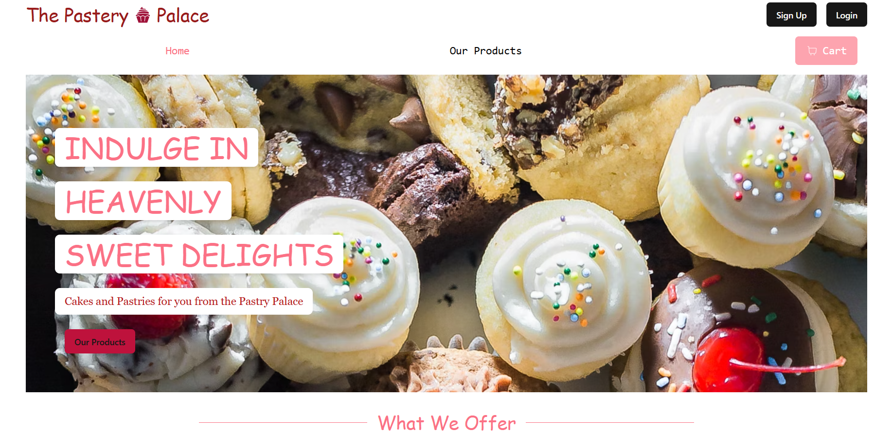

# **Bakery Website**

A full-stack e-commerce bakery application built with Next.js, featuring authentication, payment processing, and state management. This project represents my first attempt at building a complete full-stack application using modern web technologies.

## Features

**Authentication System**

- Google OAuth integration for seamless sign-in
-Credential-based authentication with MongoDB
- Protected routes and page access control

**Payment Processing**

- Stripe integration for secure payments
- Complete checkout flow

**State Management**

- Redux for global state management
- Efficient data flow across components

**Responsive Design**

- Fully responsive layout for all screen sizes
- Optimized for desktop viewing (mobile improvements planned)
- Built with **Tailwind CSS**

**Tech Stack**

- Framework: Next.js 14 (App Router)
- Language: TypeScript
- Styling: Tailwind CSS
- Authentication: NextAuth.js with Google OAuth
- Database: MongoDB
- Payment: Stripe
- State Management: Redux
- Deployment: Vercel

## Deploy on Vercel

The website is deployed on vercel here - [link](https://bakery-website-smoky.vercel.app/)
- It has google authentication
- Stripe integration
- Page view control ( you cant access certain pages without being logged on )
- Made it responsive for all views ( please look at it on a computer screen for best viewing experience)
- will work on make it more appealing to the mobile view later ( currently have many projects running )
